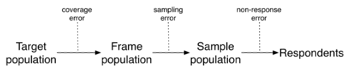

# Final Assessment
## Module 5: Sampling

1. **For the following survey, describe briefly the _target population_, the _sampling frame_ and the _frame population_, and the sampled population (or the _study population_). Discuss possible problems/issues with the sampling frames and the survey data in terms of coverage error and nonresponse bias:**  
   A survey conducted by the Dean of Mathematics at University of Waterloo (UW) indicates that about 25% of UW Computer Science graduates went to positions in the United States. Data were collected through questionnaires emailed to graduates from the past 5 years.

2. **For the following survey, describe briefly the _target population_, the _sampling frame_ and the _frame population_, and the _sampled population_ (or the _study population_). Discuss possible problems/issues with the sampling frames and the survey data in terms of coverage error and nonresponse bias:**  
   A pilot survey for The Canadian Longitudinal Study on Aging (CLSA) was conducted in the province of Ontario. The survey intended to cover the general population of the province with age 45–80 (inclusive). Survey questionnaires were sent to selected individuals through regular mail. Individuals and their mailing addresses were selected and obtained from the Provincial Health Records.

3. **For the following survey, describe briefly the _target population_, the _sampling frame_, the _sampling unit_, and _observation unit_. Discuss any possible sources of selection bias or inaccuracy of responses:**  
   The December 2003 issue of PC World reported the results from a survey of over 32,000 subscribers asking about reliability and service for personal computers and other electronic equipment. The magazine “invited subscribers to take the Web-based survey from April 1 through June 30, 2003” and received 32,051 responses. Survey respondents were entered in a drawing to win prizes. They reported that 46% of desktop PCs had at least one significant malfunction.

4. **Consider a situation where a population’s size is _N_ = 3 and the population **U** is {1, 2, 3}. There are seven possible candidate samples:**  
   $$S_1 = \{1\}, \; S_2 = \{2\}, \; S_3 = \{3\}, \; S_4 = \{1,2\}, \; S_5 = \{1,3\}, \; S_6 = \{2,3\}, \; S_7 = \{1,2,3\}.$$  
   Note that S7 = U, which corresponds to a census. Here are two sampling designs:  
   $$P(S_k) = ⅙, k = 1, 2,..., 6 and P(S_7) = 0.$$
   $$P(S_k) = ⅓, k = 4, 5, 6 and P(S_k) = 0, k = 1,2,3,7.$$
   Let $πi = P(i ∈ S)$ be the probability that unit $i$ from $U$ is included in the sample. For each of the two probability sampling designs, calculate the inclusion probabilities $π1$, $π2$, and $π3$.

5. Frankovic (2008) reported that in 1970, a poll conducted by the Harris organization for Virginia Slims, a brand of cigarettes marketed primarily to women, had the following question:
   **“There won’t be a woman president of the U.S. for a long time and that’s probably just as well.”**
Sixty-seven percent of female respondents agreed with the statement. Critique this question.

6. **The following questions, quoted in Kinsley (1981), were from a survey conducted by Cambridge Reports, Inc., and financed by Union Carbide Corporation. Critique these questions:**  
   > a. Some people say that granting companies tax credits for the taxes they actually pay to foreign nations could increase these companies’ international competitiveness. If you knew for a fact that the tax credits for taxes paid to foreign countries would increase the money available to US companies to expand and modernize their plants and create more jobs, would you favor or oppose such a tax policy?  
   > b. Do you favor or oppose changing environmental regulations so that while they still protect the public, they cost American businesses less and lower product costs?

7. **Observe Figure 3.2 in Salganik (2018).**  
   
   > a. Describe a situation in which these errors cancel out.  
   > b. Describe a situation in which these errors compound.

8. **Let N = 6 and n = 3. For purposes of studying sampling distributions, assume that all population values are known.**  

   $y_1 = 90, \; y_2 = 110, \; y_3 = 150, \; y_4 = 129, \; y_5 = 194, \; y_6 = 200.$

   We are interested in the population mean. Two sampling plans are proposed.

   | **Sample Number** | **Sample, S** | **P(S)** | **Sample Number** | **Sample, S** | **P(S)** |
   | :-----------: | :-------: | :--: | :-----------: | :-------: | :--: |
   |       1       | {1, 3, 5} |  ⅛   |       1       | {1, 4, 6} |  ¼   |
   |       2       | {1, 3, 6} |  ⅛   |       2       | {2, 3, 6} |  ¼   |
   |       3       | {1, 4, 5} |  ⅛   |       3       | {1, 3, 5} |  ½   |
   |       4       | {1, 4, 6} |  ⅛   |               |           |      |
   |       5       | {2, 3, 5} |  ⅛   |               |           |      |
   |       6       | {2, 3, 6} |  ⅛   |               |           |      |
   |       7       | {2, 4, 5} |  ⅛   |               |           |      |
   |       8       | {2, 4, 6} |  ⅛   |               |           |      |

   > a. What is the value of the sample mean?  
   > b. Let y be the mean of the sample values. For each sampling plan, find E(y) and Var(y).  
   > c. Which sampling plan do you think is better? Why?

9. **Discuss whether an SRS would be appropriate for the following situations. What other designs might be used?**  
   > a. You want to estimate the percentage of topics in a medical website that have errors.  
   > b. A county election official wants to assess the accuracy of the machine that counts the ballots by taking a sample of the paper ballots and comparing the estimated vote tallies for candidates from the sample to the machine counts.

10. Suppose that a city has 90,000 dwelling units, of which 35,000 are houses, 45,000 are apartments, and 10,000 are condominiums. You believe that the mean electricity usage is about twice as much for houses as for apartments or condominiums, and that the standard deviation is proportional to the mean so that S1 = 2S2 = 2S3. **How would you allocate a stratified sample of 900 observations if you wanted to estimate the mean electricity consumption for all households in the city?**

11. **What stratification variable(s) would you use for each of the following situations:**
    > a. A political poll to estimate the percentage of registered voters in Arizona that approve of the governor’s performance.  
    > b. A sample of public libraries in California to study the availability of computer resources, and the per capita expenditures.  
    > c. An aerial survey to estimate the number of walrus in the pack ice near Alaska between 173 degrees East and 154 degrees West longitude.

12. Kleppel et al. (2004) report on a study of wetlands in upstate New York. Four wetlands were selected for the study: Two of the wetlands drain watersheds from small towns and the other two drain suburban watersheds. Quantities such as pH were measured at two to four randomly selected sites within each of the four wetlands. **Describe why this is a cluster sample. What are the psus? The ssus? How would you estimate the average pH in the suburban wetlands?**

13. The new candy Green Globules is being test-marketed in an area of upstate New York. The market research firm decided to sample 6 cities from the 45 cities in the area and then to sample supermarkets within cities, wanting to know the number of cases of Green Globules sold. 

    | City | Number of Supermarkets | Number of Cases Sold                           |
    |------|-----------------------|------------------------------------------------|
    | 1    | 52                    | 146, 180, 251, 152, 72, 181, 171, 361, 73, 186 |
    | 2    | 19                    | 99, 101, 52, 121                               |
    | 3    | 37                    | 199, 179, 98, 63, 126, 87, 62                  |
    | 4    | 39                    | 226, 129, 57, 46, 86, 43, 85, 165              |
    | 5    | 8                     | 12, 23                                         |
    | 6    | 14                    | 87, 43, 59                                     |

    Obtain summary statistics for each cluster. Estimate the total number of cases sold, and the average number sold per supermarket, along with the standard errors of your estimates.

14. The American Council of Learned Societies (ACLS) used a stratified random sample of selected ACLS societies in seven disciplines to study publication patterns and computer and library use among scholars who belong to one of the member organizations of the ACLS (Morton and Price, 1989). The data are shown in the table below.

    | Discipline    | Membership | Number Mailed | Valid Returns | Female Members (%) |
    |---------------|------------|---------------|---------------|--------------------|
    | Literature    | 9,100      | 915           | 636           | 38                 |
    | Classics      | 1,950      | 633           | 451           | 27                 |
    | Philosophy    | 5,500      | 658           | 481           | 18                 |
    | History       | 10,850     | 855           | 611           | 19                 |
    | Linguistics   | 2,100      | 667           | 493           | 36                 |
    | Political Science | 5,500 | 833           | 575           | 13                 |
    | Sociology     | 9,000      | 824           | 588           | 26                 |
    | Totals        | 44,000     | 5,385         | 3,835         |                    |

    Calculate the response rate in each stratum for the survey. Is there evidence that the nonresponse rate varies among the strata, or that it is related to the percentage female membership?

15. Kosmin and Lachman (1993) had a question on religious affiliation included in 56 consecutive weekly household surveys; the subject of household surveys varied from week to week from cable TV use, to preference for consumer items, to political issues. After four callbacks, the unit nonresponse rate was 50%; an additional 2.3% refused to answer the religion question. The authors say: “Nationally, the sheer number of interviews and careful research design resulted in a high level of precision . . . Standard error estimates for our overall national sample show that we can be 95% confident that the figures we have obtained have an error margin, plus or minus, of less than 0.2%. This means, for example, that we are more than 95% certain that the figure for Catholics is in the range of 25.0% to 26.4% for the U.S. population.”
    > a. Critique the preceding statement.  
    > b. If you anticipated item nonresponse, do you think it would be better to insert the question of interest in different surveys each week, as was done here, or to use the same set of additional questions in each survey? Explain your answer. How would you design an experiment to test your conjecture?

16. The goal of the National Comorbidity Survey Replication is to estimate the prevalence of mental disorders in the United States. Read the survey description by Kessler et al. (2004). **What aspects of this survey might affect data quality? What design features were implemented to improve the quality of the survey?**

17. One problem that has occurred in surveys on sexual behavior in the United States is that, typically, men report more opposite-sex sexual partners than women do. This has led some researchers to be skeptical of the data quality, since one would expect the total number of opposite-sex partners for men to equal the total number of opposite-sex partners for women. Read the [article](./tourangeau_sensitive_questions.pdf) by Tourangeau and Smith (1996) on asking sensitive questions. **What steps did the authors take to reduce measurement error in their study?**

## Criteria

|Criteria|Pass|Fail|
|--------|----|----|
|All questions have been answered correctly|Every question has been answered correctly.|At least one question was not answered correctly.|

## References
- Frankovic, K. (2008). Race, gender, and bias in the electorate. Retrieved March 4, 2022, from https://www.cbsnews.com/news/race-gender-and-bias-in-the-electorate/
- Kessler, R. C., Berglund, P., Chiu, W. T., Demler, O., Heeringa, S., Hiripi, E., et al. (2004). The US National Comorbidity Survey Replication (NCS-R): Design and field procedures. _International Journal of Methods in Psychiatric Research, 13, 69–92._
- Kleppel, G. S., Madewell, S. A., and Hazzard, S. E. (2004). Responses of emergent marsh wetlands in upstate New York to variations in urban typology. _Ecology and Society, 5_, Retrieved from www.ecologyandsociety.org/vol9/iss5/art1.
- Kinsley, M. (1981). The art of polling. _New Republic, 184_, 16–19.
- Kosmin, B. A., and Lachman, S. P. (1993). _One nation under God: Religion in contemporary American society._ New York, NY: Harmony Books.
- Morton, H. C., and Price, A. J. (1989). _The ACLS survey of scholars: Final report of views on publications, computers, and libraries._ Washington, DC: University Press of America.
- Salganik, M. J. (2018). _Bit by bit: Social research in the digital age._ Princeton, NJ: Princeton University Press.
- Tourangeau, R., and Smith, T. W. (1996). Asking sensitive questions: The impact of data collection mode, question format, and question context. _Public Opinion Quarterly, 60_, 275–304.
