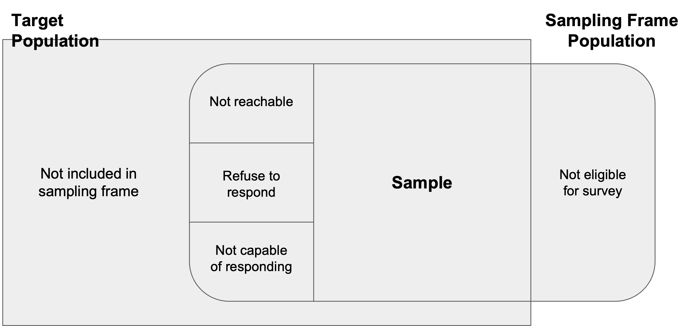
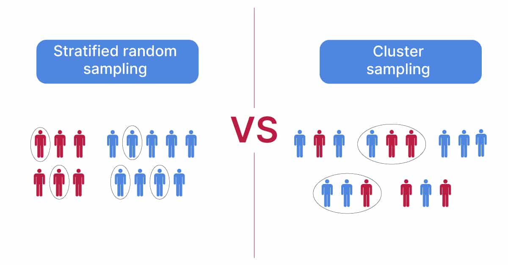

# Sampling: Populations and Samples

```code
$ echo "Data Sciences Institute"
```
---

# Learning Outcomes

*Who are you intending to study? Who is receiving your survey/being observed? How will this impact the resulting data and analysis?*

- Ability to distinguish between probability and non-probability sampling
- Ability to identify different types of sampling and their strengths and weaknesses
- Ability to distinguish between censuses, surveys, and observational studies

---

# Key Texts


- Wu and Thompson, 2020, *Sampling Theory and Practice* , Springer, Chapter 1
<!-- Image source: *[Springer](https://link.springer.com/book/10.1007/978-3-030-44246-0)* -->

---

# Survey Populations

---

# Survey Populations

- **Survey Population**:  a real or hypothetical set of units with characteristics and attributes which can be modeled by random variables and their respective probability distributions.
- May be finite or infinite
    - Infinite: The population of all outcomes of repeated coin flips
    - Finite: The population of all people living in Toronto

---

# Survey Populations

- Examples of survey populations:
    - The population of all adult Canadians (age 18+).
    - The population of all adult Canadians who are regular smokers.
    - The population of all full-time college students in Ontario.
    - The population of all children aged 6–12 (inclusive) who attend public schools in the Greater Toronto Area.

---

# Eligibility Criteria for Survey Populations

- Eligibility criteria for the inclusion or exclusion of individuals or units are used to define the survey population
- You must clearly define any terms that you use to define your population
    - What do you mean by “youth” when sampling youth in Canada?
    - What do you mean by “regular smoker” when studying university students who are regular smokers? (Once a day? Once a week?)

---

# Recall: Three Versions of Survey Populations

1. **Target Population**: the set of all units covered by the main objective of the study.
2. **Frame Population**: the set of all units covered by the sampling frame.
3. **Sampled Population**: the population represented by the survey sample.

---

# Recall: Three Versions of Survey Populations

- Adapted from Lohr (2019), Figure 1.1


<!-- A good sample -->

---

# Population Structures and Sampling Frames

---

# Population Structures

- Two primary ways of structuring a population: **stratification** and **clustering**
- Both refer to separating a population into groups ( *strata* or *clusters*, depending on the structure) such that every individual within the population belongs to one and only one group
- Under stratified sampling, sample data are collected from every stratum
- Under cluster sampling, only some clusters are sampled for data collection

---



---

# Activity: Stratification

**What kind of stratification variable(s) would you use for each of the following situations? (AKA You want to do stratified sampling, what strata would you divide the population into?)**
- A political poll to estimate the percentage of registered voters in Arizona that approve of the governor’s performance.
- A sample of public libraries in Ontario to study the availability of computer resources, and the per capita expenditures.
- An aerial survey to estimate the number of walrus in the pack ice near Alaska between 173 degrees East and 154 degrees West longitude.

---

# Observational Units & Sampling Frames

- **Observational units** are the individuals within the survey population
- **Sampling units** are the units used for selecting the survey sample
    - Sampling units could be individuals (i.e. the same as observational units) or they might be clusters within the population
- **The sampling frame** is the list of all sampling units for a given population
    - *Example:* for a university population, the sampling frame could be a list of all student emails (individual), or a list of all departments within the university (clusters) as long as each student belongs to only one department

---

# Survey Samples

---

# Censuses

- A **census** is a survey or study conducted on every observational unit within a finite target population.
- A census allows you to measure population quantities exactly (instead of calculating estimates based on samples).
- Why not use a census all the time?

---

# Censuses

- Censuses are high cost
- Censuses take time
- We can still accurately represent a population using a well-designed survey sample

---

# Survey Samples

- A survey sample, denoted by **S**, is a subset of the survey population **U**:

    > $$ S={i_1, i_2, ..., i_n} \subseteq U $$

- where *n* is the sample size and $i_1, i_2, ..., i_n$ are the distinct labels for the n units in the sample.

- Two approaches: **probability** and **non-probability** sampling

---

# Probability Survey Samples

- Every sampling unit has a chance to be included in our sample (a known **selection probability**)
- We can calculate the probability of any one sample unit being in the sample
- Non-response must be random
- Samples are representative with minimal bias (we can generalize to a whole population)
- Analysis, estimation, and inference are straightforward

---

# Types of Probability Survey Samples

- **Stratified Sampling**: Population is divided into groups called ‘strata’, then a proportionate number is taken from each stratum
- **Cluster Sampling**: The population is divided into clusters, a set of clusters are randomly selected, then every individual in the chosen clusters is included in the sample.

---

# Types of Probability Survey Samples

- **Simple Random Sampling**: Numbers are assigned to individuals in the population and randomly selected from sampling. Any group of N individuals is as likely to be chosen as any other group of N individuals.
- **Systematic Sampling**: Sampling from a random starting point and then in fixed intervals.

---

# Multi-Stage Sampling

- Like cluster sampling or stratified sampling followed by an additional stage of simple random sampling 
	- Example: We stratify our school into grades, then we select a proportionate level of classrooms from each grade (stratified sampling), and then within each classroom, we randomly select students (simple random sampling)
- Important: Each stage must involve a probability sampling method

---

# Non-probability Survey Samples

- Selecting units for our sample based on availability or some purpose → some of our population has no chance of being chosen for our sample and we don’t know the exact portion we’re excluding
- Means we can’t estimate how much our sample is really representative of our population

---

# Non-probability Survey Samples

- **Convenience sampling**: sampling restricted to certain parts of the population that are readily accessible or people who volunteer
- **Quota sampling**: interviewers are selected and required to sample a certain number of people with certain types of characteristics
- **Judgement or purposive sampling**: sample is selected based on the judgement of the sampler about what is most representative of the population
- **Snowball sampling**: Participants recruit other participants and so on until it 'snowballs' 

---

# Activity: Identifying Sampling Methods

---

# Activity

**Name the sampling method used in each of the following situations:** 

A man in the airport is handing out questionnaires to travelers asking them to evaluate the airport’s service. He does not ask travelers who are hurrying through the airport with their hands full of luggage, but instead asks all travelers who are sitting near gates and not taking naps while they wait. 

---

# Activity

**Name the sampling method used in each of the following situations:** 

A teacher wants to know if her students are doing homework, so she randomly selects rows two and five and then calls on all students in row two and all students in row five to present the solutions to homework problems to the class.

---

# Activity

**Name the sampling method used in each of the following situations:** 

The marketing manager for an electronics chain store wants information about the ages of its customers. Over the next two weeks, at each store location, 100 randomly selected customers are given questionnaires to fill out asking for information about age, as well as about other variables of interest. 	

---

# Activity

**Name the sampling method used in each of the following situations:** 

The librarian at a public library wants to determine what proportion of the library users are children. The librarian has a tally sheet on which they mark whether books are checked out by an adult or a child. They record this data for every fourth patron who checks out books.

---

# Activity

**Name the sampling method used in each of the following situations:** 

A political party wants to know the reaction of voters to a debate between the candidates. The day after the debate, the party’s polling staff calls 1,200 randomly selected phone numbers. If a registered voter answers the phone or is available to come to the phone, that registered voter is asked who they intend to vote for and whether the debate changed their opinion of the candidates.

---

# Activity (Another one!)

Let’s say there’s an election for prime minister coming up and we as political researchers want to find out which candidate Toronto voters like the best. **Assuming we want to give our survey to a sample rather than the entire voting population, what might it look like to collect a simple random sample, a systematic sample, a cluster sample, and a convenience sample? What are some drawbacks or considerations of each approach?**

---

# Observational Studies

---

#  Observational Studies

- An observational study constitutes observing a social system without intervening (i.e. without changing individuals’ behaviour)
- Surveys can be thought of as a type of observational study, although often they are considered separately (is administering a survey an intervention?)
- Observational data includes sources like government or academic records, images, or newspaper articles.
- In the context of big data, it could also include digital sources like Facebook, Twitter, or Google activity logs.

---

#  Surveying vs. Observing

- Many observational data sources contain inaccuracies or are incomplete
- Key qualitative traits like emotions, opinions, or knowledge are difficult to assess through observational studies
- Surveying and observational data can often be complementary when used together!

---

#  Linking Surveys to Observation Data

- **Enriched Asking**: A big data set is missing certain measurements, which are then collected by surveying and linked to the original data
	- Record linkage can be difficult
	- Quality of original data source may be difficult to assess
- **Amplified Asking**: A researcher trains a prediction model using survey data collected from a small number of respondents plus their corresponding records from a big data set, then uses the model to predict responses to survey questions for all individual records in the original data set
	- Faster and cheaper than large-scale surveys
	- However, currently lacks strong theoretical basis

---

#  Activity: Linking Surveys to Observation Data

We want to evaluate how well students in the DSI Certificate program are understanding course concepts. There is no budget for interviews or surveys with students, but we have access to all online records of the program (Slack chat records, grading spreadsheets, attendance, class recordings).

- **How could we use these observational data to address our research question?**
- **Our budget and timeline suddenly get expanded – how can we use survey data to supplement our research? How would the survey and observational data be linked?**

---

# Principle Steps in Surveying

Wu and Thompson, Section 1.5.3
- A clear statement of the objectives of the survey.
- Determination of the population to be sampled.
- Determination of the relevant data to be collected.
- Determination of the required accuracy of estimates.
- Construction of sampling frames.

---

# Principle Steps in Surveying (continued...)

Wu and Thompson, Section 1.5.3
- Choice of the sampling method.
- Organization of the field work for data collection.
- Plans for handling nonresponse.
- Production of the survey dataset.
- Summaries and analyses of the survey data.
- Reports or publications on the study.


<!-- Note how few steps involve actual data analysis -->

---

# Next

- Simple probability samples (errors, sample means, weights)
- Systematic Sampling
- Stratified sampling  and quota sampling


