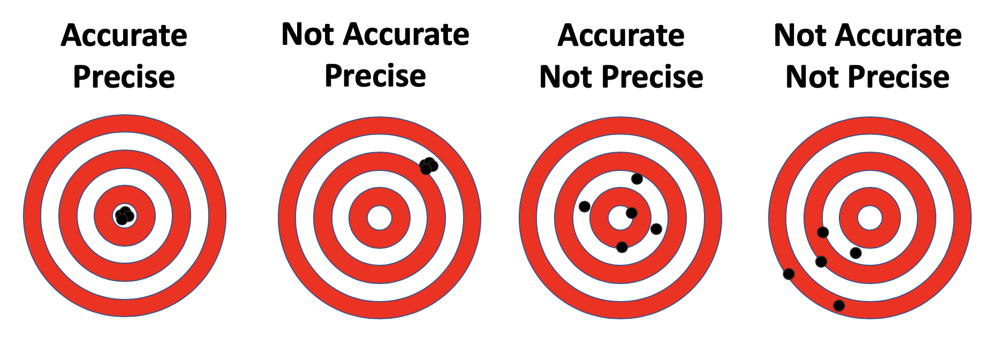

# Sampling: Cluster sampling

```code
$ echo "Data Sciences Institute"
```
---

# Learning Outcomes

*How might our study be impacted if we sample entire groups of individuals from our population based on shared characteristics? How do we effectively study a sample selected in this manner?*

- Identify benefits of using cluster sampling
- Compute sample statistics for cluster samples
- Design a study using cluster sampling
- Distinguish between different types of cluster sampling, and between cluster sampling and stratified sampling

---

# Calculating Sample Size

---

# Recall: Choosing sample size in strata

- Proportional Allocation
    - Sample the same proportion of units from each stratum
    - Sample weights $(\pi_{hi})$ are the same for each sampled unit regardless of stratum
- Optimal Allocation
    - Variation among larger sampling units may be greater than variation among smaller sampling units, so a higher proportion of large units should be sampled
    - Useful for businesses, cities, and institutions like schools or hospitals
- Allocation for **Precision** with Strata
    - Sample to reduce the variation in stratum-level estimates, not population-level estimates
    - Useful when the goal is comparing estimates between strata

---

# What is precision?

- **Precision** = How close our measurements are to each other 
- **Accuracy** = How close our measurements are to the ‘true’ value



---

# Calculating Sample Size

1. Determine the desired precision for the quantities that will be estimated from the sample.
	- What are the consequences of the study results? How much error is tolerable?
2. Find an equation relating the sample size n and your desired precision from step 1.
	- Precision should be in terms of error or variation
3. Estimate unknown quantities in the equation and solve for n.

---

# Calculating Sample Size: Takeaways

- We can decide how precise we need our study to be, and by stating that precision in terms of error and confidence, can calculate the needed sample size
- Doing that calculation will require making some assumptions (about the distribution of our population, about the standard deviation) and justifying them

---

# Sample size: Power

- Other than focusing on precision (when we’re estimating), it is common to calculate sample size based on power (when we’re trying to test a hypothesis)
- **Power**
	- How small of a difference or treatment effect do I need to be able to detect?
	- High power = High chance of my study correctly identifying a true effect (lower chance of false negatives)

---

# Sample size considerations

- Often the initial sample size calculated will be much larger than what is realistic
	- Is the study feasible given the available budget and desired precision?
- Adjust estimates or precision expectations accordingly
	- Larger sample = smaller sampling error, but a larger sample size may increase non-sampling errors

---

# Cluster Sampling

---

# Cluster Sampling

1. Divide the whole population into non-overlapping subpopulations based on shared characteristics. These subpopulations are called **clusters**.
2. Randomly select a sample of clusters.
3. Survey every individual unit within each sampled cluster.

---

# Sampling Units

- **Primary sampling units (PSUs)**
  - Groupings in the first iteration of sampling – in this case, clusters
- **Secondary sampling units (SSUs)**
  - Individuals units who are selected and/or surveyed directly
  - Also known as the observational units
- Observational units are only included in the sample if they belong to the sampled PSU (cluster)

---

# Why use cluster sampling?

- It may be difficult, expensive, or impossible to create a sampling frame of individual (non-clustered) sampling units
  - For example, all birds in a forest or all individuals in a city at a given time
- Population may occur in natural or pre-existing clusters
  - For example, households or schools
  - For geographically widespread populations, sampling by cluster reduces the chance of extensive travel to reach a single individual

---

# Why ***not*** use cluster sampling?

- Decreased precision
  - SSUs in each cluster tend to share similar characteristics
  - More difficult to generalize to population-level estimates

---

# Cluster sampling versus stratified sampling

- Both are non-overlapping subpopulations for a given population
- Clusters are often defined for convenience, while strata may be defined to benefit particular types of analysis
- Sampling procedure is different
  - Stratified sampling: define strata → sample within each stratum → survey/observe units in the samples
  - Cluster sampling: define clusters → sample a subset of clusters → survey/observe all units in each sampled cluster

---

- Based on Lohr, 2019, Figure 5.1


---

# One-Stage Cluster Sampling

---

# One-Stage Cluster Sampling

- A random subset of PSUs (clusters) is sampled, and all SSUs within each sampled PSU are measured
- Used when the cost of measuring SSUs is small compared with the cost of sampling PSUs

---

# Clusters of ***Equal*** Sizes: Notation

- Let *N* represent the total number of PSUs. Let *n* represent the number of sampled PSUs. Let $t_i$ represent the total for all elements in PSU *i* .
- Let *M* represent the number of people in each cluster. In one stage cluster sampling with samples of equal size, *$M = M_i = m_i$* for all *i* .
  - Interpretation: The number of people in each cluster ($M_i$) is the same for all clusters, and all units from each sampled cluster are measured ($m_i$)

---

# Clusters of **Equal** Sizes: PSU Total

- Let $y_{ij}$ represent the measurements from SSU (observational unit) *j* within PSU (cluster) *i* . The total measurement within PSU *i* is,
  
  > $$ t_i=\sum_{j=1}^{M}y_{ij} $$

- The total across all PSUs can be estimated with,

  > $$ \hat{t}=\frac{N}{n}\sum_{i=1}^{n}t_i $$

- This is a weighted sum of the total measurements from each individual cluster.

---

# Clusters of Equal Sizes: Sample Mean

- To estimate the average per SSU (observational unit), divide the estimated total by the total number of SSUs:

  > $$ \hat{\bar{y}}=\frac{\hat{t}}{N M} $$

- $\hat{\bar{y}}$ is an estimator for the sample mean $\bar{y}$ . Since the calculation involves the estimator for the population total, *this is not a direct calculation of the sample mean*.

---

# Clusters of Equal Sizes: Sample Variance

- The sample variance of the PSU totals is,

  > $$ s_t^2=\frac{1}{n-1}\sum_{i=1}^{N}(t_i-\frac{\hat{t}}{N})^2 $$

- $s_t^2$ can then be used to compute the standard error of the estimated sample mean:

  > $$ SE(\hat{\bar{y}}) = \sqrt{\frac{1}{M} \left(1 - \frac{n}{N}\right)\frac{s_t^2}{n}} $$

---

# Clusters of Equal Sizes: Weights

- One-stage cluster sampling with clusters of equal sizes produces a self-weighting sample, with weights,

  > $$ w_{ij} = \frac{N}{n} $$

- These weights can be used to estimate the sample total and mean directly from SSU measurements $y_{ij}$ :

  > $$ \hat{t} = \sum_{i=1}^{N} \sum_{j=1}^{M} w_{ij}y_{ij}$$

  > $$ \hat{\bar{y}} = \frac{\hat{t}}{N M} = \frac{\sum_{i=1}^{N} \sum_{j=1}^{M} w_{ij}y_{ij}}{\sum_{i=1}^{N} \sum_{j=1}^{M} w_{ij}} $$

---

# Clusters of ***Unequal*** Sizes: Notation

- The definitions for *n, N,* and $t_i$ are the same as previously.
- Let $M_i$ represent the number of people in PSU (cluster) *i* . For clusters of unequal sizes, it is now possible that $M_i \neq M_j$ for $i \neq j$.
- One-stage sampling means that $m_i = M_i$ still (all SSUs in each cluster are sampled).

---

# Clusters of ***Unequal*** Sizes: SSU Total

- The total number of SSUs in the population is defined as,

  > $$ M_0=\sum_{i=1}^{N}M_i $$

- This can be computed directly when the size of every PSU is known. However, this is not always possible. $M_0$ can thus be estimated:

  > $$ \hat{M}_0=\frac{N}{n}\sum_{i=1}^{n}M_i $$

---

# Clusters of ***Unequal*** Sizes: PSU Total

- The total within each PSU can be estimated nearly the same way as for clusters of equal sizes, with the difference that $M_i$ may be different for different clusters:

  > $$ t_i=\sum_{j=1}^{M_i}y_{ij} $$

- The total across all PSUs can be estimated with,

  > $$ \hat{t}=\frac{N}{n}\sum_{i=1}^{n}t_i $$

- This is the same as for clusters of equal sizes.

---

# Clusters of ***Unequal*** Sizes: Sample Mean

- The sample mean can be calculated using the estimates for *t* and $M_0$ :

  > $$ \hat{\bar{y}} = \frac{\hat{t}}{\hat{M}_0} = \frac{\sum_{i=1}^{n} t_i}{\sum_{i=1}^{n} M_i} $$

- This can also be calculated using weights, with the same weights and calculation as for clusters of equal sizes:

  > $$ \hat{\bar{y}} = \frac{\hat{t}}{\hat{M}_0} = \frac{\sum_{i=1}^{N} \sum_{j=1}^{M_i} w_{ij}y_{ij}}{\sum_{i=1}^{N} \sum_{j=1}^{M_i} w_{ij}} $$

---

# Clusters of ***Unequal*** Sizes: Sample Mean Variance

- The standard error for the sample mean can be estimated as follows,

  > $$ SE(\hat{\bar{y}})=\sqrt{(1-\frac{n}{N})\frac{1}{n\bar{M}^2}\frac{\sum_{i=1}^{N}M_i^2(\bar{y}_i-\hat{\bar{y}})^2}{n-1}}$$

- where $\bar{y}_i$ represents the sample mean within PSU *i* and $\bar{M}$ represents the mean number of SSUs in each PSU.

- ⚠️ **Takeaway**: If our clusters are different sizes, the ways that we estimate sample mean, error, and variance change. It matters! ⚠️ 

---

# Two-Stage Cluster Sampling

---

# Two-Stage Cluster Sampling

- A random subset of PSUs (clusters) is selected, and then a random sample of the SSUs (observational units) within each PSU is selected for observation.
- Two stage sampling might be used if:
  - The cost of sampling SSUs is relatively high compared with the cost of sampling PSUs
  - Elements in a cluster are very similar to each other

---

- Based on Lohr, 2019, Figure 5.2


---

# Two-Stage Cluster Sampling: Selection Probability

- Since sampling is occurring at two different stages now, the selection probability of $y_{ij}$ (the $j^{th}$ SSU in PSU *i* ) is a combination of the probability of PSU *i* being selected, and the probability of SSU *j* being selected within PSU *i*. Assuming an SRS is taken at both stages, we have:

  > $$ \begin{multline}
  \pi_{ij} = P(j^{th}\text{ SSU in }i^{th}\text{ PSU selected}) \\
  = P(i^{th}\text{ PSU selected}) \cdot P(j^{th}\text{ SSU }\text{selected}\text{ | }i^{th}\text{ PSU }\text{selected}) \\
  \end{multline}
  $$
  > $$ = \frac{n}{N}\frac{m_i}{M_i} $$

---

# Two-Stage Cluster Sampling: Weights

- As always, the weight of observational unit $y_{ij}$ is the reciprocal of its selection probability.
  
  > $$ w_{ij}=\frac{1}{\pi_{ij}}=\frac{N M_i}{nm_i}$$

- If $m_i/M_i$ is approximately constant for all PSUs (i.e. a proportional sample from all clusters), this is considered a self-weighting sample.

---

# Two-Stage Cluster Sampling: Population Total

- The population total can be estimated in the same was as one-stage cluster sampling.

  > $$ \hat{t}=\sum_{i=1}^{N}\sum_{j=1}^{M_i}w_{ij}y_{ij} $$

---

# Two-Stage Cluster Sampling: Sample Mean

- The sample mean can be calculated using the estimates for *t* and $M_0$. This is much the same as in one-stage cluster sampling, except the totals for each PSU must now be estimated as well:

  > $$ \hat{\bar{y}} = \frac{\hat{t}}{\hat{M}_0} = \frac{\sum_{i=1}^{n} t_i}{\sum_{i=1}^{n} M_i} $$

- This can also be calculated using weights, with the same weights and calculation as for one-stage sampling:

  > $$ \hat{\bar{y}} = \frac{\hat{t}}{\hat{M}_0} = \frac{\sum_{i=1}^{N} \sum_{j=1}^{M_i} w_{ij}y_{ij}}{\sum_{i=1}^{N} \sum_{j=1}^{M_i} w_{ij}} $$

---

# Two-Stage Cluster Sampling: Sample Variance

- With two-stage sampling, there are two types of variance: **between** PSUs, and **within** PSUs. Both calculations follow a familiar structure.
- The variance between PSUs can be calculated,

  > $$ s^2=\frac{1}{n-1}\sum_{i=1}^{n}(M_i\bar{y}_i-M_i\hat{\bar{y}})^2 $$

- The variance within PSU *i* can be calculated,

  > $$ s_i^2=\frac{1}{m_i-1}\sum_{j=1}^{m_i}(y_{ij}-\bar{y}_i)^2 $$

---

# Two-Stage Cluster Sampling: Estimator Variance

- The estimated variance of the sample mean is also comprised of variance within and between PSUs,

  > $$ \hat{V}(\hat{\bar{y}})=\frac{1}{\bar{M}^2}(1-\frac{n}{N})\frac{s^2}{n}+\frac{1}{nN\bar{M}^2}\sum_{i=1}^{n}M_i^2(1-\frac{m_i}{M_i})\frac{s_i^2}{m_i} $$

- where $s^2$ and $s_i^2$ are defined as previous, and $\bar{M}$ is the average PSU size.
- ⚠️ **Takeaway**: Two-stage sampling changes our mean calculations and changes the chances for any individual to be included in our sample ⚠️ 

---

# Choosing a PSU Size

- Often will come about naturally
  - There may be pre-existing groupings that can be used as clusters
  - Examples: classrooms, farms, stores
- Larger PSU size means larger variability within a PSU
- PSUs that are too large or too small may reduce cost saving benefits of cluster sampling

---

# Choosing a Sub-Sample Size $(m_i)$

- Cost
	- Is measuring more SSUs marginally expensive or inexpensive?
- Accessibility
    - Do you have access to all SSUs in a given PSU? How difficult is it to measure more SSUs?
- Homogeneity
	- Are all the SSUs in a given PSU relatively similar? How much more information is gained by measuring more SSUs?
- **In general, the same considerations as an SRS apply.**

---

# Choosing a Sample Size $(n)$

This process is similar to selecting sample sizes for SRS.
1. Determine precision needed.
2. Propose PSU and sub-sample sizes.
3. Calculate the variance that will be achieved.
4. Choose *n* to achieve desired precision.
5. Iterate until *n* is realistic given available resources.

---

# Next
Errors

