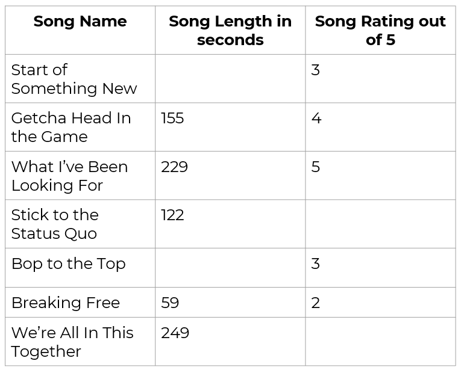
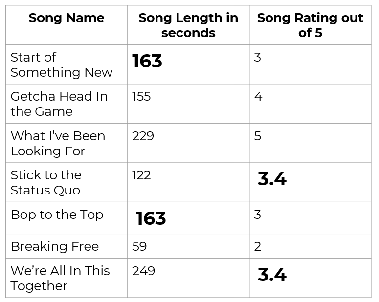

# Sampling: Survey Quality and Questionnaire Design

```code
$ echo "Data Sciences Institute"
```
---

# Learning Outcomes

- *How can we tell if our survey is high quality? What are some potential inaccuracies in data resulting from surveys, and what causes them?*

  1. Define and identify factors affecting survey quality
  2. Assess survey quality

---

# Why do we care about survey quality?

- Reliability
	- Can we trust our results?
	- Does our survey fulfill the intended purpose?
- Funding
	- Justify budgetary allocation
	- Get approved for funding
- Ethics
	- Surveys impact participants, surveyors, stakeholders 

---

# Factors Impacting Survey Quality

---

# Measures of Quality

- Depending on the purpose of the survey, there are many different ways to define and assess quality:
  - **Relevance** – results must meet an identified need
  - **Accuracy** – Estimates must be close to the true population quantities
  - **Timeliness** – Results must be available and distributed quickly
  - **Accessibility** – Data and results must be accessible to users in an interpretable fashion

---

# Measures of Quality

- (continued)
  - **Comparability** – Surveys that are intended for comparison with other surveys (i.e. over time or between regions) must be designed and conducted such that estimate comparisons are meaningful
  - **Coherence** – Common definitions and standards should be used when data comes from different sources
  - **Completeness** – Statistics should be available for all areas of  identified need

---

# Activity: Priorities (Costs and Benefits!)

My team is doing a survey of Canadian public servants to learn their feelings about artificial intelligence (AI) use in government. My team’s goal is to present the results of this survey to our director general before she establishes our organization’s official AI strategy for the next 10 years. One of my colleagues wants to prioritize getting results on time (**timeliness**). Another wants to focus on making sure we represent the opinions of all different types of employees (**completeness**). I’m mostly concerned with making sure that our estimates are as close as possible to true values (**accuracy**). 

**For each priority (timeliness, completeness, accuracy)**
- **How could this change the way we plan and implement our survey?**
- **What could be some unintended consequences of prioritizing this measure of quality?**

---

⚠️*Improving quality means maximizing measures of quality while minimizing errors*⚠️

---

# Validity

- How well does the data gathering method measure what it’s supposed to measure?
- Types: 
	- Internal validity = validity of results within our study
	- External validity = can our results be applied outside of our specific study (is it representative)? 
- Sampling practices directly impact external validity

---

# Questionnaire Design

- Keep questions simple and clear
- Be specific in your questions
- Forced choice vs. ‘Select all that apply’
- Question order matters
	- Anchoring
	- Priming
- Avoid leading questions

---


# Questionnaire Design

- Think about open vs. closed questions
- Consider social desirability bias
- No double negatives
- Avoid providing too many options for multiple choice questions
- No double-barrelled questions

---

# Questionnaire Design and Measurement Error

- First, need to identify sources and prevalence of measurement error
  - Can be identified through randomized experiments addressing different components of survey design (question, interviewers, etc.)
- Some strategies for reducing measurement error (depending on type of survey):
  - Write clear questions
  - Test questions prior to releasing the survey
  - Write clear procedures for administering the survey
  - Hire good surveyors or interviewers
  - Provide consistent training and supervision for interviewers
  - Give surveyors a reasonable workload

---

# Survey Mode

- The medium in which our survey is conducted
- For example: mail, email, telephone, website pop-up
- Different survey modes give different coverage issues, which we can address by 
	- Comparing our sampling frame with external sources
	- Choosing a survey mode with high coverage for our target population

---

# Coverage and Survey Mode

- **Mail or email**
  - Sampling frame is generally a list of addresses – coverage depends on accuracy and completeness of the list
    - People may have moved or changed email addresses
    - Excludes people who don’t use email
- **Telephone**
  - Sampling frame is either a list of phone numbers from a directory or random digit dialing
    - Coverage is difficult to track for cellphone-only households, which tend to differ from those with landlines

---

# Coverage and Survey Mode

- Internet
  - Difficult to specify a frame and measure coverage of specific populations
  - Generally don’t use probability sampling – coverage is unknown since participants tend to be volunteers

---

# Sensitive Questions and Measurement Error

- Respondents may not respond accurately to questions about sensitive topics
  - Illegal behaviours
  - Information that poses risk to respondents if disclosed (health conditions, cheating on a partner)
  - Private information (income, home address)
  - Emotionally upsetting topics 
  - Socially or politically charged topics 

---

# Reducing Nonresponse to Sensitive Questions

- Explain and inform
- Consider survey mode
- Who is asking the questions?
	- Identity/positionality
	- Observational skills
	- Mannerisms 
- Confidentiality and anonymity 
	- More on this one later!

---

# Additional Factors Affecting Survey Response

- Distribution time
- Incentives
- Follow-up
- Pilot studies and ‘user testing’

---

# Activity: Evaluating Questionnaire Design

To help me evaluate my performance as facilitator of this sampling class, I’ve designed a questionnaire. Unfortunately, I’m bad at survey design and this questionnaire is the worst document ever created. Please go through my survey and identify what’s wrong with it and why.

---

# Improving Survey Quality

---

# Why are data missing? – Modeling solutions

- Three types of missing data to consider: 
	- Missing completely at random (MCAR)
	- Missing at random (MAR) given covariates
	- Not missing at random (NMAR) 
- We can account for data that are MAR given covariates in our models and analysis
- Models can help when data are NMAR, but cannot completely remove bias

---

# Weighting Class Adjustment

- Variables known for all observational units in the sample are used to divide respondents into different weighting adjustment classes under the assumption that respondents and nonrespondents in the same class share similar characteristics.
- **Weights of respondents in each class are increased according to the number of nonrespondents in the class.**
- In final calculations, respondents in each class represent the nonrespondents in their class as well as themselves.

---

# Weighting Class Adjustment

- Assumptions:
	- Data is MAR
	- Response probability is the same for all elements in each class
	- Nonrespondents in a given weighting class share similar responses to respondents in the same weighting class
- Weighting classes should be constructed such that units in each class are as similar as possible with respect to the main variable(s) of interest (similar to stratification)

---

# Poststratification

- **Respondents are stratified and weights are modified so they match population counts.**

Procedure:
1. An SRS is taken from the population.
2. Sampled units are grouped into H distinct poststrata (usually based on demographic variables).
3. Population units are grouped into same strata and counted.
4. The weight of each respondent in a given stratum is increased according to how many units in the corresponding population stratum they represent.

---

# Weighting & Poststratification Considerations

- Weight adjustment can improve but not eliminate nonresponse bias
- Always need to consider the plausibility of assumptions involved
- Always need to state and justify any adjustments or models used

---

# Resampling

- **Resampling** = estimating our parameter or variable of interest multiple times from our sample
- Resampling can help improve the accuracy of our estimate and to quantify the uncertainty of our estimates
- Can be computationally expensive

---

# Types of Resampling

- Bootstrap (drawing randomly with replacement from our sample)
- Jackknife (‘cutting’ our sample)

---

# Resampling Resources

- Chapter 10 of Wu & Thompson (2020) [Free PDF download]: https://link.springer.com/book/10.1007/978-3-030-44246-0 
- General overview of different resampling methods: http://strata.uga.edu/8370/lecturenotes/resampling.html
- Tutorial with example code for bootstrapping in Python (machine learning focused but still useful!): https://carpentries-incubator.github.io/machine-learning-novice-python/07-bootstrapping/index.html 

---

# Imputation

- **Imputation** = assigning values to missing items in a dataset
- Reduces nonresponse bias, produces cleaner datasets
- Different methods: 
	- Random sample from observations, mean of existing observations, linear regression, prediction based on other respondents with similar non-missing responses

---

# Example: Mean Imputation

- We recorded song length and rating for a random sample of songs, but our dataset has some missing values. 
- How can we address our missing values with mean imputatation? 



---

# Example: Mean Imputation

- We do mean imputation by ‘filling the blanks’ with the mean (average) of each variable, based on existing observations
- Mean imputation is the simplest solution to missing data, but generally not the best. **Why can mean imputation be problematic?**



---

# Imputation Considerations

- Imputation allows data to be analyzed using standard processes and software
- If data is MAR, imputation can greatly reduce item nonresponse bias
- Any imputation needs to be well documented
  - This may include: indicating which responses are imputed, which donor was used for a specific value, how many times a record is used as a donor
- Variance of estimates computed using imputed data will be smaller than the true variance

---

# Remember Reproducibility!

- However we choose to deal with missing data, we must
	- Justify our choices
	- Consider impacts of our choices
	- Document our choices
- Datasheets! (checklists, ‘labels’) 
	- https://arxiv.org/pdf/1803.09010.pdf 

---

# Next

Ethics

