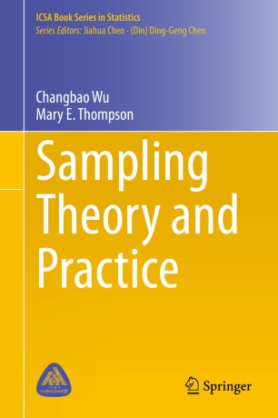

# Sampling: Populations, censuses, surveys, and observational data

```code
$ echo "Data Science Institute"
```
---

# Learning Outcomes

*Who are you intending to study? Who is receiving your survey/being observed? How will this impact the resulting data and analysis?*

- Ability to distinguish between target, frame, and sampled populations
- Ability to identify different types of sampling and their strengths and weaknesses
- Ability to distinguish between censuses, surveys, and observational studies

---

# Key Texts



- Wu and Thompson, 2020, *Sampling Theory and Practice* , Springer, Chapter 1
<!-- Image source: *[Springer](https://link.springer.com/book/10.1007/978-3-030-44246-0)* -->

---

# Survey Populations

---

# Survey Populations

- **Survey Population**:  a real or hypothetical set of units with characteristics and attributes which can be modeled by random variables and their respective probability distributions.
- May be finite or infinite
    - Infinite: The population of all outcomes of repeated coin flips
    - Finite: The population of all people living in Toronto

---

# Survey Populations

- Survey sampling deals with finite populations
- Examples of survey populations:
- The population of all adult Canadians (age 18+).
- The population of all adult Canadians who are regular smokers.
- The population of all full-time college students in Ontario.
- The population of all children aged 6–12 (inclusive) who attend public schools in the Greater Toronto Area.

---

# Eligibility Criteria for Survey Populations

- Eligibility criteria for the inclusion or exclusion of individuals or units are used to define the survey population
- You must clearly define any terms that you use to define your population
    - What do you mean by “youth” when sampling youth in Canada?
    - What do you mean by “regular smoker” when studying university students who are regular smokers?

---

# Three Versions of Survey Populations

1. **Target Population**: the set of all units covered by the main objective of the study.
2. **Frame Population**: the set of all units covered by the sampling frame.
3. **Sampled Population**: the population represented by the survey sample.

---

- Adapted from Lohr (2019), Figure 1.1


<!-- A good sample -->

---

# Population Structures and Sampling Frames

---

# Population Structures

- Two primary ways of structuring a population: *stratification* and **clustering**
- Both refer to separating a population into groups ( *strata* or *clusters, * depending on the structure) such that every individual within the population belongs to one and only one group
- Under stratified sampling, sample data are collected from every stratum
- Under cluster sampling, only some clusters are sampled for data collection

---

# Statistical Units & Sampling Frames

- **Observational units** are the individuals within the survey population
- **Sampling units** are the units used for selecting the survey sample
    - Sampling units could be individuals (i.e. the same as observational units) or they might be clusters within the population
- **The sampling frame** is the list of all sampling units for a given population
    - Example: for a university population, the sampling frame could be a list of all student emails (individual), or a list of all departments within the university (clusters) as long as each student belongs to only one department

---

# Exercise

> Wu and Thompson, Example 1.1

- An education worker wanted to find out the average number of hours each week (of a certain month and year) spent on watching television by 4 and 5 year old children in the Region of Waterloo. She conducted a survey using the list of 123 pre-school kindergartens administered by the Waterloo Region District School Board. She first randomly selected ten kindergartens from the list. Within each selected kindergarten, she was able to obtain a complete list of all 4 and 5 year old children, with contact information for their parents/guardians. She then randomly selected 50 children from the list and mailed the survey questionnaire to their parents/guardians. The sample data were compiled from those who completed and returned the questionnaires. 

---

# Exercise

> Wu and Thompson, Example 1.1

- What is the target population ?
- What is the sampling frame ?
- What are the sampling and observational units ?
- What is the frame population ?
- What is the sampled population ?
        
<!-- 
- The target population: All 4 and 5 year old children in the Region of Waterloo at the time of the survey. This is defined by the overall objective of the study.
- Sampling frames: Two-stage cluster sampling methods were used. The first stage sampling frame is the list of 123 kindergartens administered by the school board. The second stage sampling frames are the complete lists of all 4 and 5 year old children for the ten selected kindergartens.	
- Sampling units and observational units: The first stage sampling units are the kindergartens; the second stage sampling units are the individual children (or equivalently, their parents); observational units are individual children.					
- The frame population: All 4 and 5 year old children who attend one of the 123 kindergartens in the Region of Waterloo. It is apparent that children who are home-schooled are not covered by the frame population. Thus, as is frequently the case, the frame population is not the same as the target population.
- The sampled population: All 4 and 5 year old children who attend one of the 123 kindergartens in the Region of Waterloo and whose parents/guardians would complete and return the survey questionnaire if the child was selected for the survey.
-->

---

# Survey Samples

---

# Censuses

- A **census** is a survey or study conducted on every observational unit within a finite target population.
- A census allows you to measure population quantities exactly (instead of calculating estimates based on samples).

---

# Survey Samples

- A survey sample, denoted by **S**, is a subset of the survey population **U**:

    > $$ S={i_1, i_2, ..., i_n} \subseteq U $$

- where *n* is the sample size and $i_1, i_2, ..., i_n$ are the distinct labels for the n units in the sample.

- Two approaches: **probability** and **non-probability** sampling

---

# Justification for Using Survey Samples

- Three main justifications for using a survey sample:
    1. Cost
        - Samples are much cheaper to survey than entire populations
    2. Time
        - Surveying a sample and disseminating results is relatively quick
    3. Accuracy
        - It is easy to make errors when surveying a large population, and a well-designed survey sample can still accurately represent a population

---

# Probability Survey Samples

- Every sampling unit has a known **selection probability**
- Often some element of **randomization** involved
- Samples are **representative** with minimal **bias**
- Analysis, estimation, and inference are straightforward
- **Examples**
    - Simple random sampling
    - Stratified sampling
    - Cluster sampling

---

# Non-probability Survey Samples

- **Restricted sampling**: sampling restricted to certain parts of the population that are readily accessible
- **Quota sampling**: interviewers are selected and required to sample a certain number of people with certain types of characteristics.
- **Judgement or purposive sampling**: sample is selected based on the judgement of the sampler about what is most-representative of the population.
- **Sample of convenience**: sample is selected from an easy-to-reach population.
- **Sample of volunteers**: sample comprised of individuals who volunteer to participate in the survey
- **Opt-in panel**

---

# Principle Steps in Surveying

Wu and Thompson, Section 1.5.3
- A clear statement of the objectives of the survey.
- Determination of the population to be sampled.
- Determination of the relevant data to be collected.
- Determination of the required accuracy of estimates.
- Construction of sampling frames.

---

# Principle Steps in Surveying (continued...)

Wu and Thompson, Section 1.5.3
- Choice of the sampling method.
- Organization of the field work for data collection.
- Plans for handling nonresponse.
- Production of the survey dataset.
- Summaries and analyses of the survey data.
- Reports or publications on the study.


<!-- Note how few steps involve actual data analysis -->

---

# Observational Studies

---

# Observational Studies

- An **observational study** constitutes observing a social system without intervening (i.e. without changing individuals’ behaviour)
- Surveys can be thought of as a type of observational study, although often they are considered separately
- Observational data includes sources like government or academic records, images, or newspaper articles.
- In the context of big data, it could also include digital sources like Facebook, Twitter, or Google activity logs.

---


| Censuses                            | Surveys                                                                                                                                                                                                             | Observational Studies                                                                                                                                                                                                                                                              |
| :---------------------------------- | :------------------------------------------------------------------------------------------------------------------------------------------------------------------------------------------------------------------ | :--------------------------------------------------------------------------------------------------------------------------------------------------------------------------------------------------------------------------------------------------------------------------------- |
| - The Canadian Census of Population | - The Canadian General Social Survey<br>- The American Community Survey<br>- Political polls – FiveThirtyEight, 338Canada<br>- Consumer or market research surveys – Survey Junkie, Swagbucks, Daily Rewards Canada | - The Impact of Hurricane Maria on Out-migration from Puerto Rico: Evidence from Facebook Data (Alexander et al., 2019)<br>- Increasing concentration of COVID-19 by socioeconomic determinants and geography in Toronto, Canada: an observational study (Sharmistha et al., 2021) |

<!-- 
- Go through each observational study and note the source of the data used, why it is considered observational, and how the results differ from results that could be obtained from a survey.

- Alexander, M., Polimis, K. and Zagheni, E. (2019), The Impact of Hurricane Maria on Out-migration from Puerto Rico: Evidence from Facebook Data. Population and Development Review, 45: 617-630. https://doi.org/10.1111/padr.12289

- Mishra S, Ma H, Moloney G, Yiu KCY, Darvin D, Landsman D, Kwong JC, Calzavara A, Straus S, Chan AK, Gournis E, Rilkoff H, Xia Y, Katz A, Williamson T, Malikov K, Kustra R, Maheu-Giroux M, Sander B, Baral SD; COVID-19 Heterogeneity Research Group. Increasing concentration of COVID-19 by socioeconomic determinants and geography in Toronto, Canada: an observational study. Ann Epidemiol. 2021 Jul 25:S1047-2797(21)00216-7. doi: 10.1016/j.annepidem.2021.07.007. Epub ahead of print. PMID: 34320380. 
-->

---

# References

- Alexander, M., Polimis, K. and Zagheni, E. (2019), The Impact of Hurricane Maria on Out-migration from Puerto Rico: Evidence from Facebook Data. Population and Development Review, 45: 617-630. https://doi.org/10.1111/padr.12289

- Mishra S, Ma H, Moloney G, Yiu KCY, Darvin D, Landsman D, Kwong JC, Calzavara A, Straus S, Chan AK, Gournis E, Rilkoff H, Xia Y, Katz A, Williamson T, Malikov K, Kustra R, Maheu-Giroux M, Sander B, Baral SD; COVID-19 Heterogeneity Research Group. Increasing concentration of COVID-19 by socioeconomic determinants and geography in Toronto, Canada: an observational study. Ann Epidemiol. 2021 Jul 25:S1047-2797(21)00216-7. doi: 10.1016/j.annepidem.2021.07.007. Epub ahead of print. PMID: 34320380.

---

# Next

Essentials of sampling, asking, and observing

