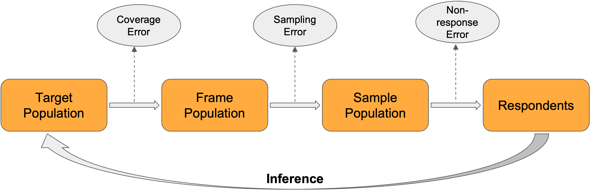

# Sampling: Errors

```code
$ echo "Data Science Institute"
```
---

# Learning Outcomes

*How might your sampling and surveying approach cause inaccuracies in your data?*

- Ability to identify sources of error in sampling and survey methodology.
- Ability to distinguish between different types of errors, such as variance and bias, sampling and non-sampling errors, etc.

---

# Variance and Bias

---

# Variance and Bias

| Variance                                                                                     | Bias                                                                                                                                                                                                                                 |
| :------------------------------------------------------------------------------------------- | :----------------------------------------------------------------------------------------------------------------------------------------------------------------------------------------------------------------------------------- |
| - Random error<br />- Describes variability of calculated quantities<br />- Want to minimize | - Systematic error<br />- Describes difference between calculated and true quantities (i.e. between sample statistics and population parameters)<br />- Ideally, we want to eliminate bias. In practice, this is often not possible. |

---

- Lohr, 2019, Figure 2.3
**Which of these displays high variance and which displays high bias?**


---

# Sampling Errors

---

# Sampling Errors

- **Sampling error** is the error that results from taking a given sample instead of measuring the entire frame population
- Different samples will likely produce different sample statistics, and these sample statistics will likely be different from the true population parameter
- Sampling error can only be avoided if the frame population and sample population are exactly the same
- **Example**: margin of error

---

# Non-Sampling Error

- **Non-sampling error** is error that does not occur as the result of variability between different samples
- Often systemic (i.e. a result of study design or pre-existing characteristics of the population)
- **Examples**: selection bias, measurement error

---

# Selection Bias

---

# Selection Bias

- **Selection bias** occurs when some population units are unintentionally excluded from the sample population
- Results in a non-representative sample
- May often arise in non-probability samples which more commonly sample certain types of individuals by virtue of their design (i.e. convenience or judgement sampling)

---

# Sources of Selection Bias

Lohr, 2019, Section 1.3
- Using a sample selection procedure that, unknown to the investigators, depends on some characteristic associated with the properties of interest
- Deliberately or purposively selecting a “representative” sample
- Misspecifying the target population
- Failing to include all of the target population in the sampling frame (**undercoverage**)
- Including population units in the sampling frame that are not in the target population (**overcoverage**)

---

# Sources of Selection Bias (continous...)

Lohr, 2019, Section 1.3
- Having multiplicity of listings in the sampling frame, without adjusting for the multiplicity in the analysis
- Substituting a convenient member of a population for a designated member who is not readily available
- Failing to observe responses from all of the chosen sample (**nonresponse**)
- Allowing the sample to consist entirely of volunteers

---
# Overcoverage versus Undercoverage

- **Undercoverage** may occur when certain individuals are not able to be reached by the survey (i.e. they do not own a phone or have a permanent address) or because individual-level data is systematically inaccessible (i.e. individuals in the prison system or long-term care facilities)
- **Overcoverage** may occur when ineligible units in the general population are not removed from the frame population, or when those who are collecting data are not properly informed about sample eligibility and collect data from ineligible individuals

---

# Exercise
What would undercoverage and overcoverage looks like if you have to sample the City of Toronto?

---

# Non-Response Error

---

# Non-Response Error

- Sampled individuals who participate in a survey or study are called **respondents**
- **Non-response error** occurs when members of the sample do not respond to the survey or study (i.e. when the respondents to a survey are only a subset of the sample)
- **Non-response bias** occurs when respondents are systematically different from those who didn’t respond

Non-response will be covered in greater depth in **Module 5.8**

---

# Representation

---

# Representation

“Representation is about making inferences from your respondents to your target population” - Salganik, 2018



---

# Measurement Error

---

# Measurement Error

- **Measurement error** occurs when survey responses tend to differ from the true population value
- **Measurement bias** occurs when measurement errors tends to occur consistently in one direction

---

# Sources of Measurement Error

Lohr, 2019, section 1.4
- People sometimes do not tell the truth
- People do not always understand the questions
- People forget
- People give different answers to different people

---

# Sources of Measurement Error (continued...)

- People may say what they think an interviewer wants to hear or what the think will impress the interviewer
- A particular interviewer may affect the accuracy of the response, by misreading question, recording responses inaccurately or antagonizing the respondent
- Certain words mean certain things to different people
- Question wording and question order have a large effect on the responses obtained

---

# Total Survey Error Framework

---

# Total Survey Error Framework

> Total Survey Error = Representation Errors + Measurement Errors

- The total survey error framework states that there are two types of error – **bias** and variance – and there are two sources of these errors – **representation** and **measurement**.

    - Representation errors
        - Coverage error
        - Sampling error
        - Selection bias
        - Non-response error
        - Non-response bias

---

# Total Survey Error Framework (continued...)

> Total Survey Error = Representation Errors + Measurement Errors

- The total survey error framework states that there are two types of error – **bias** and variance – and there are two sources of these errors – **representation** and **measurement**.

    - Measurement errors
        - Measurement error
        - Measurement bias

---

# Next
Simple Probability Samples
